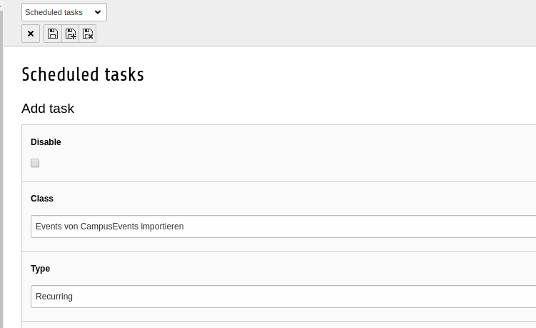
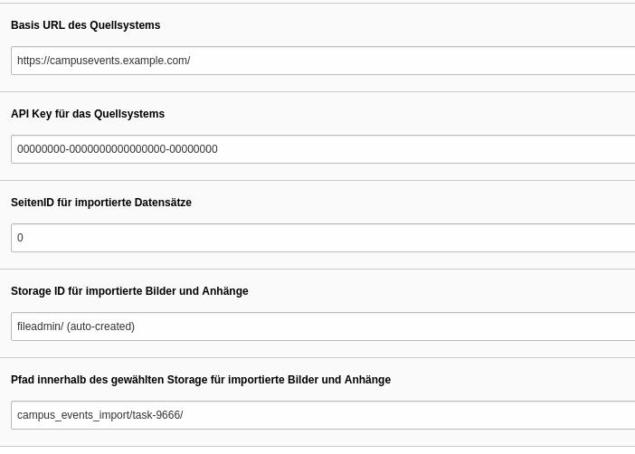

.. include:: ../Includes.txt

.. _installation:

============
Installation
============

Simply install the extension via composer or download it from the TER.

.. _installation-schedulertask:

Scheduler Task
====

The main part of this extension lies inside the scheduler task.

Here you can configure your params.

And now I explain the different Parameters.

.. _installation-baseurl:

Base-Url of the source system
====

Simply type the URL to your Campus Events System.

.. _installation-api:

API-Key of the source system
====

Insert the API-Key from the source system. You can find it at XY.

.. _installation-pageid:

PageID for imported records
====

The page where your imported records should be saved.

.. _installation-imagepath:

Path for imported images and documents
====

The folder where your imported images and documents should be saved.

.. _installation-innerpath:

Inner path for imported images and documents
====

The folder inside your previously defined folder to save your imported images and documents.
